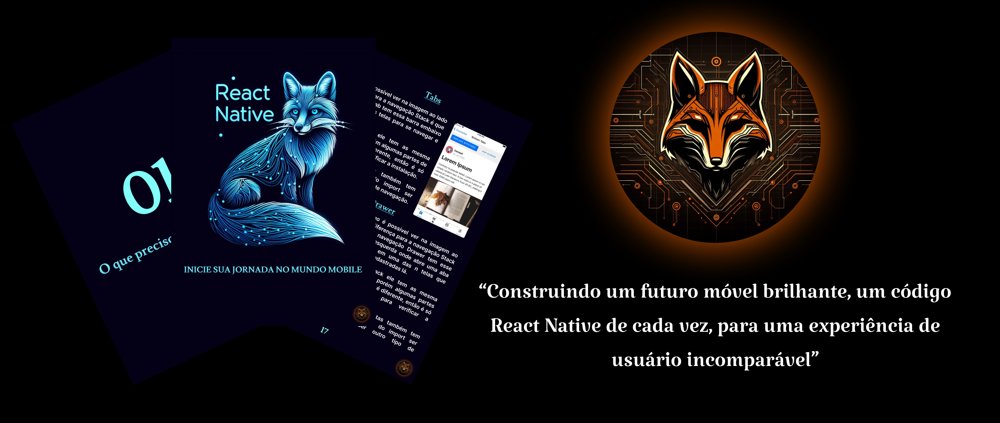

# E-book_Para_iniciantes_em_react_native
 Desvende os segredos do React Native! Meu novo e-book, fruto de mentoria com o renomado Felipe Aguiar, é a chave para descomplicar o aprendizado para iniciantes. Explore os fundamentos de forma clara e prática, com uma seleção de recursos indispensáveis. Baixe agora e acelere sua jornada no desenvolvimento mobile! 

 <a href="https://www.linkedin.com/posts/fellipe-nascimento-guedes-_inicie-sua-jornada-no-mundo-mobile-activity-7199920521944125440-Bu5I?utm_source=share&utm_medium=member_desktop" title="View PDF now"> 📕Clique aqui para ler</a>

## 💻 Tecnologias utilizadas no projeto

- [ChatGPT](https://chat.openai.com/)
- [Copilot](https://www.bing.com/chat)
- [Figma](https://www.figma.com)

## 🧠 Prompts

Copilot:
|   Ação   | prompts                                                                            |
| :------: | ---------------------------------------------------------------------------------- |
| capa | Gere uma raposa usando essa imagem como base (minha logo) e o símbolo do React Native. |

ChatGPT:

|   Ação   | prompts                                  |
| :------: | ---------------------------------------- |
| exemplos | Gere um exemplo de : componentes, hooks. |
| corrigir | corrija o seguinte texto.                |
